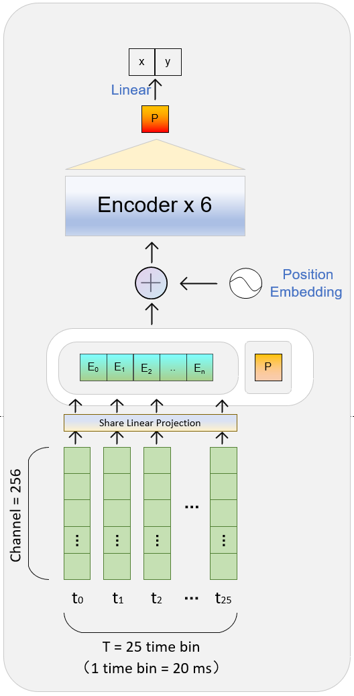

# NDT47
version 2: 可跨object，跨天，跨角速度

## model


## data preparation
```
unzip data.zip
```
and data folder is like this:
```
data/
└── 1205_psth_TCR/
    └── end_pos.csv
    └── psth_trial_1.csv
        ...
    └── psth_trial_n.csv
└── 1207_psth_TCR/
    ...
└── 1208_psth_TCR/
    ...
        	
```

## train decode end pos, using 25 bins(20ms/bin) before-MO to decode end positions
```python
# train on 0314 data and test on (0315,0320,0321,0322) data directly
CUDA_VISIBLE_DEVICES=0 python train.py --name "(0314)_(0315,0320,0321,0322)_zscore" --normalize_method zscore --cfg 'config/nezha_cross_day_(0314)_(0315,0320,0321,0322).yaml'
```

## train decode trajectory, using 25 bins(20ms/bin) before-MO to decode trajectory
```python
# train on 0314 data and test on (0315,0320,0321,0322) data directly
CUDA_VISIBLE_DEVICES=0 python train4traj.py --name "Bohr_(0402)_zscore" --normalize_method zscore --cfg 'config/Bohr_(0402).yaml'
```